<h1 align="center">Tenure</h1>

<p align="center">
  <b>입었던 기록을 남기고, 판매할 때 옷의 가치를 보여주다</b>
</p>

<p align="center">
  OOTD 사진 속 아이템의 누적된 착용 기록을 확인하고,<br>
  거래 제안까지 이어갈 수 있는 패션 거래 서비스
</p>

<p align="center">
  
  
  
  
  
</p>

<p align="center">
  <a href="https://api.chungs.store/swagger-ui/index.html">📄 API 문서 (Swagger)</a>
</p>

---

## 프레젠테이션

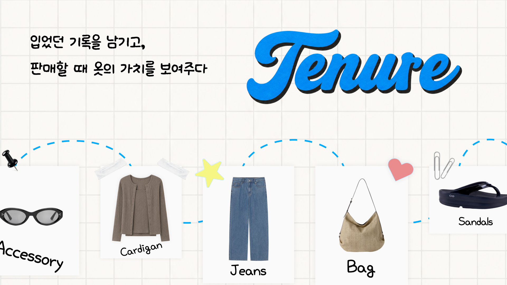
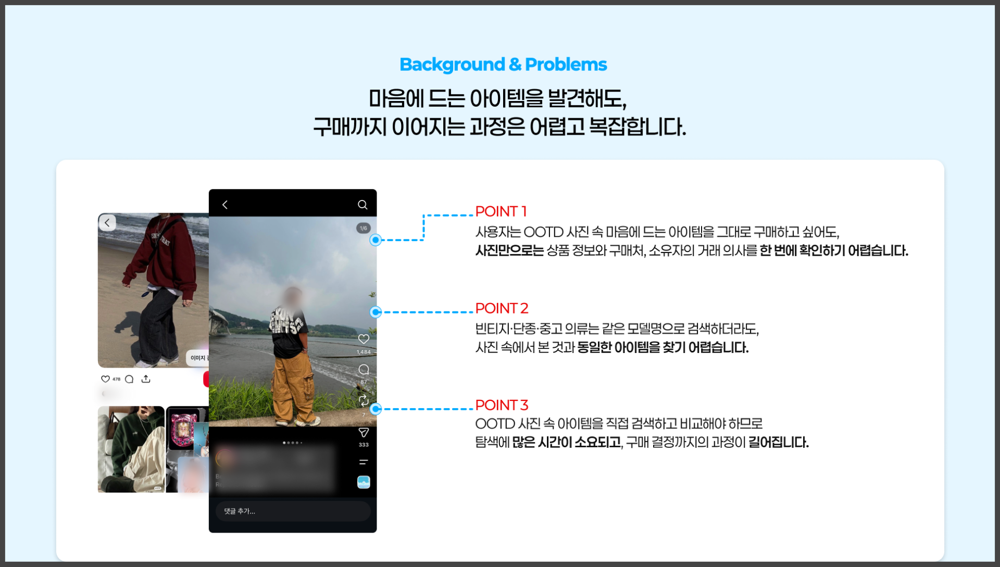
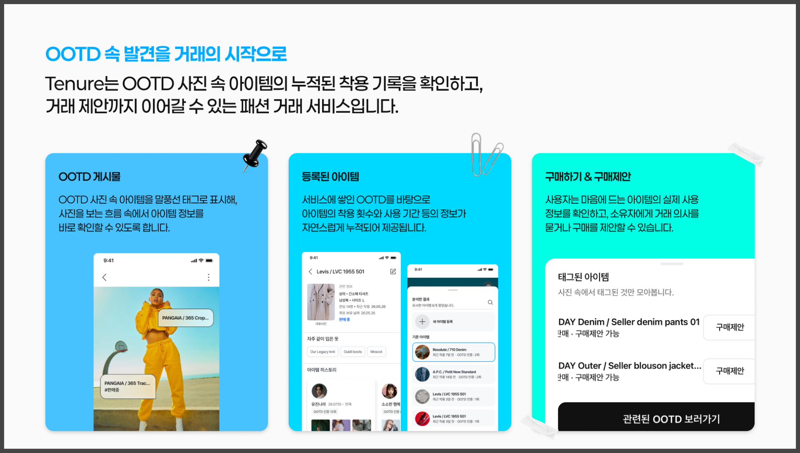
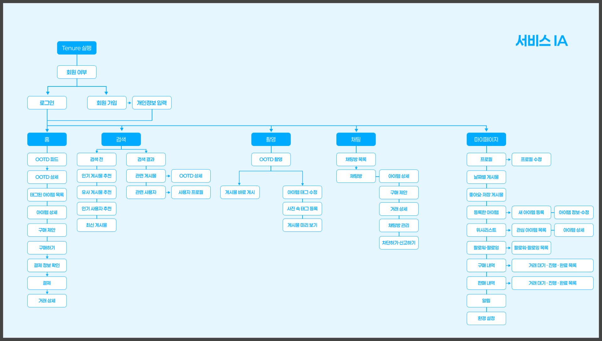
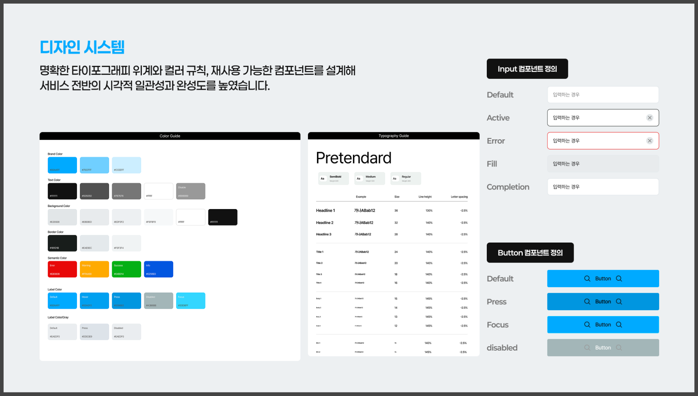
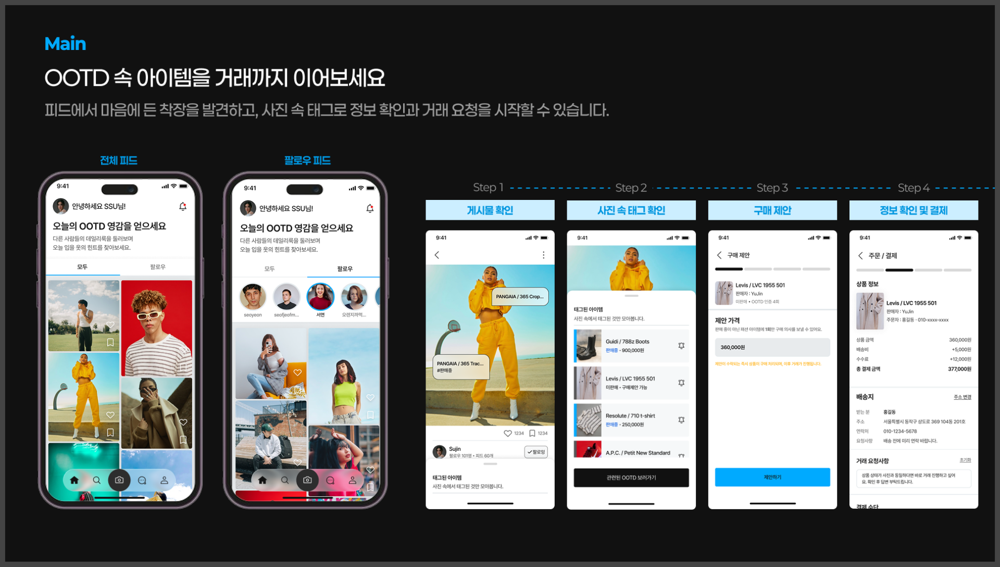
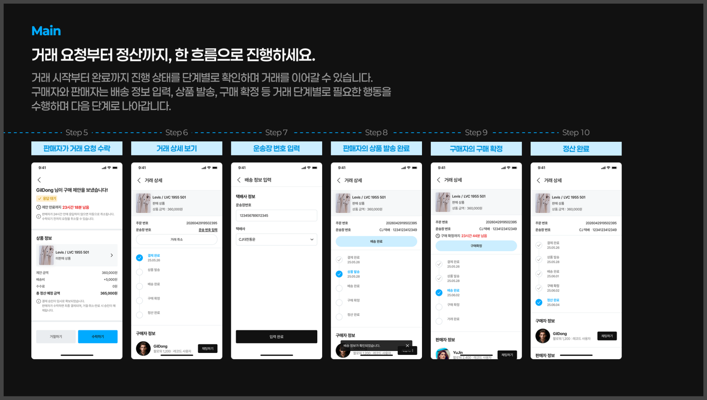
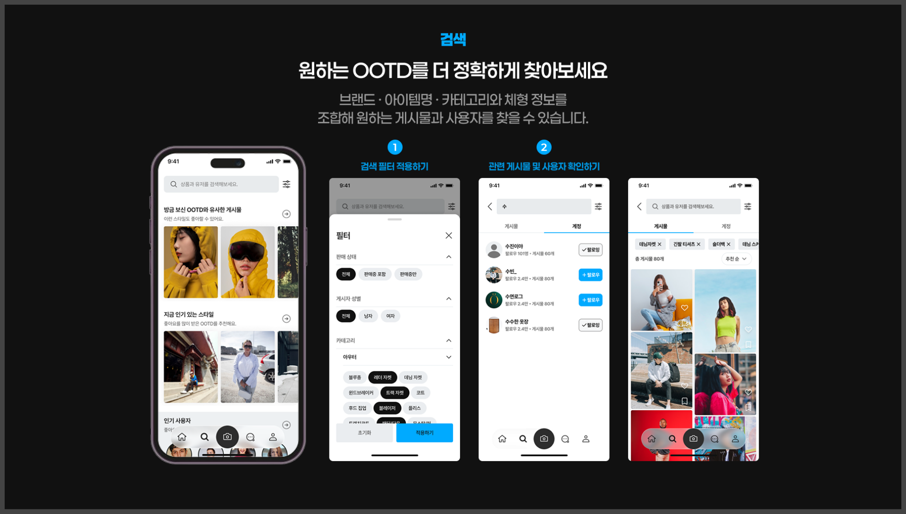
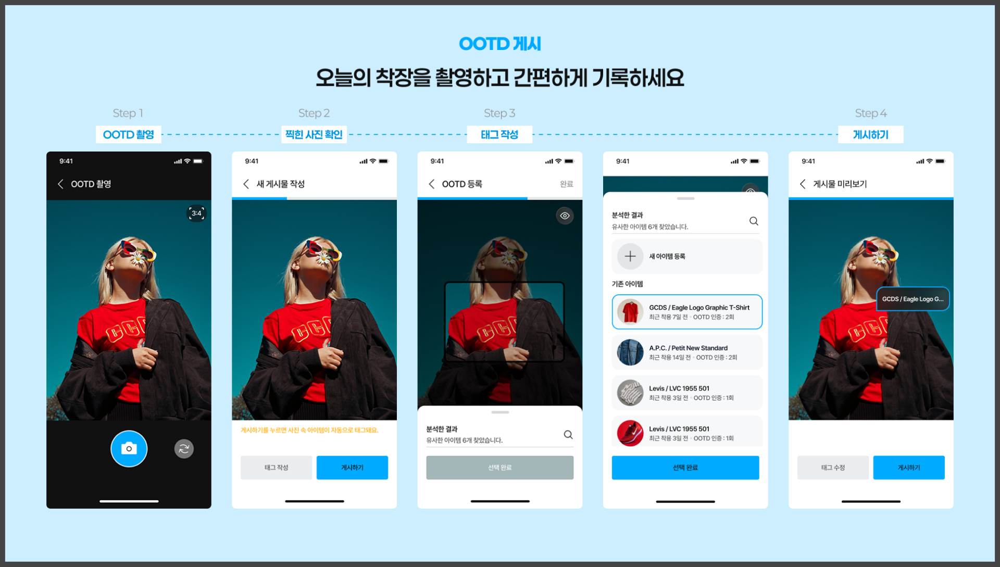
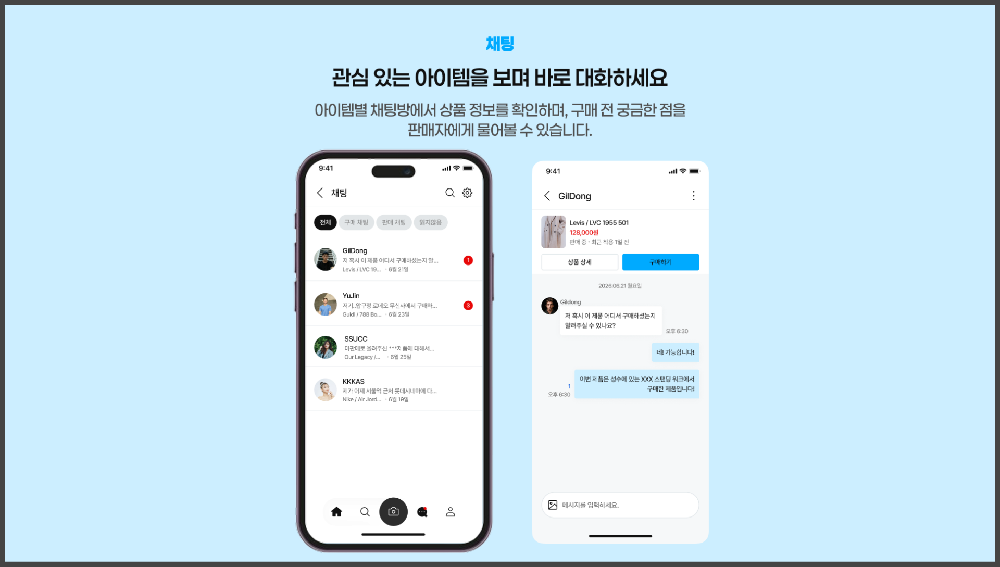
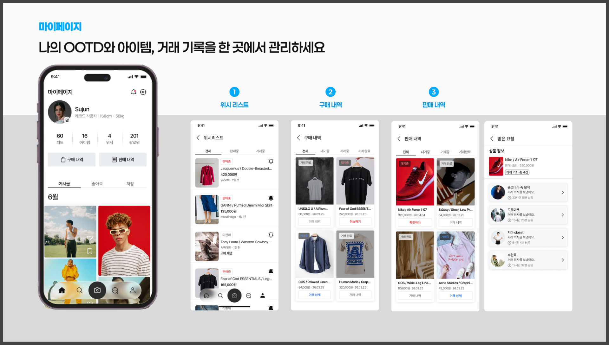
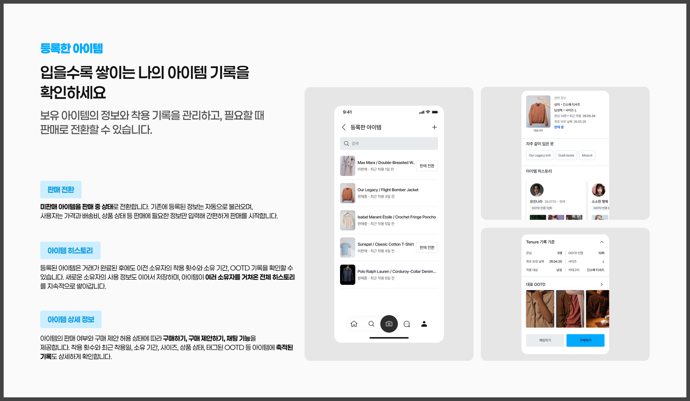


---

## 핵심 기능

| 기능 | 설명 |
|------|------|
| **OOTD 피드** | 전체/팔로우 피드에서 착장을 탐색하고, 사진 속 태그로 아이템 정보 확인 및 구매 제안 |
| **OOTD 게시** | 착장 촬영 후 Gemini AI가 아이템을 자동 인식·태그, 간편하게 게시 |
| **등록된 아이템** | 착용 횟수·기간 등 누적 기록 확인, 필요 시 판매로 전환 |
| **거래** | 구매 제안 → 수락 → 배송 → 구매 확정 → 정산까지 단계별 거래 진행 |
| **채팅** | 아이템별 채팅방에서 판매자와 실시간 대화 및 구매 상담 |
| **마이페이지** | OOTD·아이템·위시리스트·구매/판매 내역 통합 관리 |

---

## 기술 스택

### Backend
| 분류 | 기술 |
|------|------|
| Language | Java 17 |
| Framework | Spring Boot 3.5.16 |
| Build | Gradle |
| ORM | Spring Data JPA |
| DB Migration | Flyway |
| Auth | Spring Security, JWT |
| Real-time | WebSocket (채팅) |
| Mail | Spring Mail (이메일 인증) |
| AI | Google Gemini (아이템 자동 태그) |
| Docs | SpringDoc OpenAPI (Swagger) |

### Database / Storage
| 분류 | 기술 |
|------|------|
| Database | PostgreSQL (AWS RDS) |
| File Storage | AWS S3 |

### Infra / DevOps
| 분류 | 기술 |
|------|------|
| Cloud | AWS EC2, ECR, RDS, S3 |
| Container | Docker, Docker Compose |
| Reverse Proxy | Nginx |
| SSL | Let's Encrypt |
| CI/CD | GitHub Actions |

---

## 시스템 아키텍처

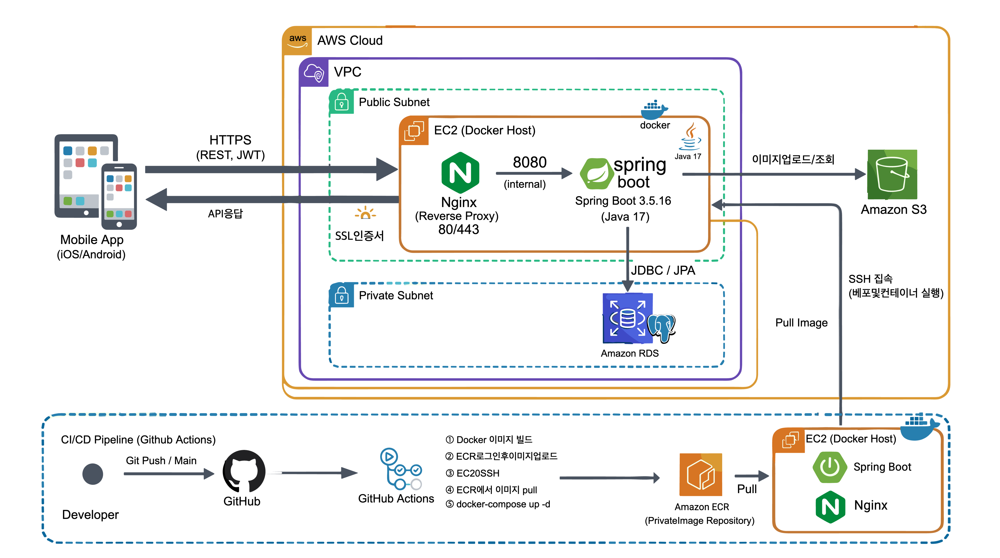

---

## ERD

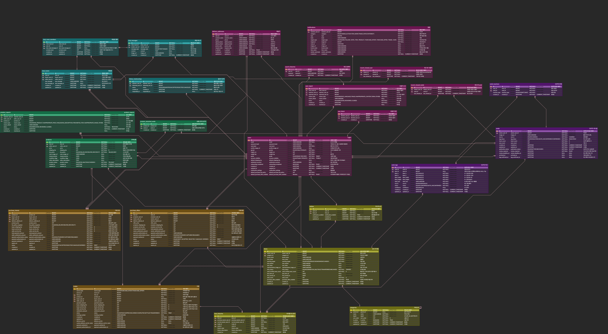

---

## API 문서

배포 환경: **[https://api.chungs.store/swagger-ui/index.html](https://api.chungs.store/swagger-ui/index.html)**

---

## 로컬 개발 환경 설정

### 요구 사항
- Java 17
- PostgreSQL

### 환경 변수

```bash
DB_URL=jdbc:postgresql://localhost:5432/Tenure_DB
DB_USERNAME=your_username
DB_PASSWORD=your_password
JWT_SECRET=your_jwt_secret_at_least_32_bytes
ENCRYPTION_SECRET=your_aes_secret_32_bytes
```

### 실행

```bash
./gradlew bootRun
```

로컬 파일 스토리지 기본 설정(`STORAGE_TYPE=local`)으로 실행됩니다.
업로드 파일은 `./uploads` 디렉토리에 저장됩니다.

---

## CI/CD 파이프라인

`main` 브랜치에 push하면 자동으로 배포됩니다.

```
main push
  └─→ [1] 테스트 실행 (통과해야 배포 진행)
        └─→ [2] Docker 이미지 빌드 → ECR push
              └─→ [3] EC2 SSH 접속
                    ├─ docker-compose.yml, nginx.conf 전송
                    ├─ ECR에서 새 이미지 pull
                    └─ docker compose up -d
```

---

# Tenure Backend Convention

### 필독 
- 모든 작업은 Repository를 로컬에 clone 하여 시작합니다.
## 1. Git Convention

### 1.1 브랜치 전략

| 브랜치                                     | 용도                |
|-----------------------------------------|-------------------|
| `main`                                  | 배포 가능한 최종 브랜치     |
| `develop`                               | 개발 통합 브랜치         |
| `feature/{issue-number}-{feature-name}` | 기능 개발 브랜치         |
| `fix/{issue-number}-{bug-name}`         | 버그 수정 브랜치         |
| `refactor/{issue-number}-{target}`      | 리팩토링 브랜치          |
| `docs/{issue-number}-{doc-name}`        | 문서 수정 브랜치         |
| `chore/{issue-number}-{task-name}`      | 설정, 빌드, 기타 작업 브랜치 |

### 1.2 브랜치 예시

```text
feature/12-auth-login
feature/23-ootd-tag
fix/31-trade-status
refactor/42-item-service
docs/50-api-spec
chore/61-swagger-config
```

### 1.3 작업 흐름

- GitHub Issue를 생성한다.
- develop 브랜치에서 작업 브랜치를 생성한다.
- 기능 구현 후 로컬에서 테스트와 빌드를 확인한다.
- 작업 브랜치를 원격 저장소에 push한다.
- develop 브랜치로 Pull Request를 생성한다.
- 최소 1명 이상의 코드 리뷰 승인을 받는다.
- CI 또는 빌드가 성공하면 PR을 merge한다.
- 데모 또는 배포 시점에 develop에서 main으로 merge한다.

### 1.4 브랜치 삭제 규칙

- `main`, `develop` 브랜치는 삭제하지 않는다.
- `feature/*`, `fix/*`, `refactor/*`, `docs/*`, `chore/*` 브랜치는 PR이 `develop`에 merge된 후 삭제한다.
- merge가 완료된 원격 브랜치는 PR 작성자가 삭제한다.
- 로컬 브랜치는 각자 작업자가 정리한다.
```text
git branch -d feature/12-auth-login
git fetch --prune
```
- 아직 배포 전 문제가 생길 가능성이 있는 작업은 PR과 커밋 기록으로 추적한다.
- 이미 merge된 브랜치에서 추가 수정하지 않고, 필요한 수정은 새 브랜치를 생성해서 작업한다.

## 2. Commit Convention

### 2.1 커밋 메시지 형식

```text
   type(scope): subject
```

### 2.2 type 규칙

| type     | 의미                             |
|----------|--------------------------------|
| feat	    | 새로운 기능 추가                      |
| fix	     | 버그 수정                          |
| docs     | 	문서 수정                         |
| style	   | 코드 포맷팅, 세미콜론, 공백 등 기능 변경 없는 수정 |
| refactor | 	리팩토링                          |
| test	    | 테스트 코드 추가 또는 수정                |
| chore	   | 빌드, 설정, 패키지 관리 등 기타 작업         |
| perf	    | 성능 개선                          |
| ci	      | CI/CD 설정 수정                    |
| rename   | 	파일명 또는 폴더명 변경                 |
| remove   | 	파일 또는 코드 삭제                   |

### 2.3 커밋 예시
```text
feat(auth): JWT 로그인 기능 추가
feat(item): 아이템 판매 전환 API 추가
fix(trade): 거래 상태 변경 검증 로직 수정
docs(api): API 명세서 거래 영역 수정
refactor(ootd): OOTD 조회 서비스 로직 분리
test(offer): 구매 제안 중복 요청 테스트 추가
chore(config): Swagger 설정 추가
```

## 3. Code Style Convention

### 3.1 네이밍 규칙
| 구분 | 규칙 | 예시 |
| --- | --- | --- |
| 클래스명 | PascalCase | `UserService`, `TradeController` |
| 메서드명 | camelCase | `createTrade`, `findMyItems` |
| 변수명 | camelCase | `userId`, `itemStatus` |
| 상수명 | UPPER_SNAKE_CASE | `MAX_IMAGE_COUNT` |
| 패키지명 | lowercase | `com.tenure.domain.item` |
| DB 테이블명 | snake_case | `purchase_offers` |
| DB 컬럼명 | snake_case | `owner_user_id` |
| API URL | 복수형 리소스 중심 | `/items/{itemId}` |

### 3.2 패키지 구조
```text
예시)
com.tenure
├─ domain
│   ├─ auth
│   ├─ user
│   ├─ address
│   ├─ follow
│   ├─ ootd
│   ├─ tag
│   ├─ search
│   ├─ item
│   ├─ wish
│   ├─ product
│   ├─ purchase
│   ├─ trade
│   ├─ chat
│   └─ notification
└─ global
├─ config
├─ security
├─ response
├─ exception
└─ util
```

### 3.3 계층별 역할
| 계층 | 역할 |
| --- | --- |
| Controller | 요청/응답 처리, 인증 사용자 전달, 비즈니스 로직 작성 금지 |
| Service | 비즈니스 로직, 권한 검증, 트랜잭션 처리 |
| Repository | DB 접근 |
| Entity | DB 테이블 매핑 |
| DTO | 요청/응답 데이터 전달 |
| Mapper | Entity와 DTO 변환 |

### 3.4 코드 작성 규칙
- Controller에서는 비즈니스 로직을 작성하지 않는다.
- Entity를 API 응답으로 직접 반환하지 않는다.
- Request DTO와 Response DTO를 분리한다.
- 로그인 사용자는 JWT에서 추출한 currentUserId를 사용한다.
- 내 정보, 내 아이템, 내 거래, 내 알림 조회에는 userId를 요청값으로 받지 않는다.
- Path Variable로 받은 리소스 ID는 반드시 권한 검증을 수행한다.
- 상태값은 문자열 하드코딩 대신 Enum을 사용한다.
- 거래, 구매 제안, 판매 전환처럼 상태 변경이 있는 기능은 @Transactional을 사용한다.
- 예외는 공통 예외 객체와 에러 코드를 사용한다.
- 모든 API 응답은 공통 응답 형식을 사용한다.

## 4. Git Comment Convention

### 4.1 PR 리뷰 코멘트 태그

| 태그 | 의미 |
| --- | --- |
| `[필수]` | 반드시 수정해야 하는 내용 |
| `[제안]` | 더 나은 방향을 제안하는 내용 |
| `[질문]` | 의도를 확인하기 위한 질문 |
| `[공유]` | 참고하면 좋은 정보 |
| `[칭찬]` | 좋은 구현에 대한 피드백 |

### 4.2 리뷰 코멘트 예시
```text 
[필수] 이 API는 본인 아이템인지 확인하는 권한 검증이 필요합니다.

[제안] 거래 상태 변경 로직은 TradeStatus enum 내부 메서드로 분리하면 좋을 것 같습니다.

[질문] 구매 제안은 사용자당 아이템별 1회만 가능한 정책인데, 중복 검증은 어디에서 처리되나요?

[공유] 이 부분은 추후 WebSocket 도입 시에도 재사용될 수 있어서 서비스 계층에 두는 것이 좋아 보입니다.

[칭찬] 예외 케이스가 명확하게 분리되어 있어서 읽기 좋습니다.
```
## 5. PR Merge Rules

### 5.1 PR 생성 규칙
```text
[type] 작업 내용 요약
```
예시
```text
[feat] 아이템 판매 전환 API 구현
[fix] 구매 제안 중복 요청 오류 수정
[docs] API 명세서 거래 영역 수정
```

### 5.2 PR 본문 포함 항목

```text
## 작업 내용
- 
## 변경된 API
- 
## 테스트 결과
- 
## 확인 필요 사항
- 
```
### 5.3 Merge 조건
```text
- 최소 3명 이상의 리뷰 승인을 받아야 한다.
- main, develop 브랜치에 직접 push하지 않는다.
- 빌드가 성공해야 한다.
- 충돌은 PR 작성자가 해결한다.
- API 변경 시 Swagger 또는 API 명세서를 함께 수정한다.
- DB 구조 변경 시 ERD 또는 관련 문서를 함께 수정한다.
- 공통 응답, 예외 처리, 인증 방식에 영향을 주는 변경은 팀원에게 공유한다.
```

